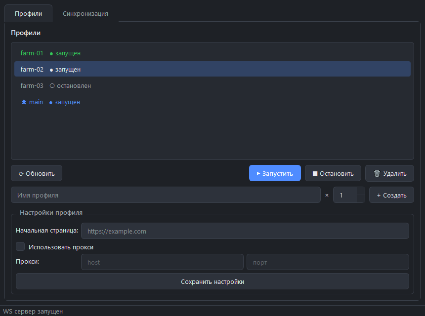
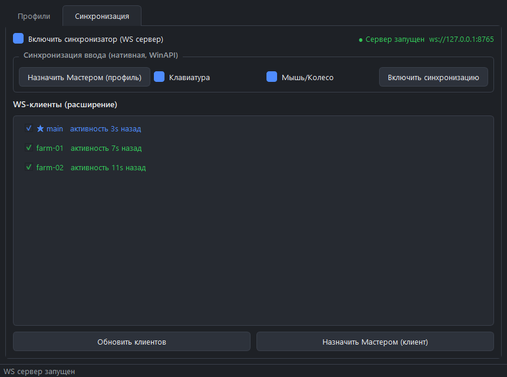
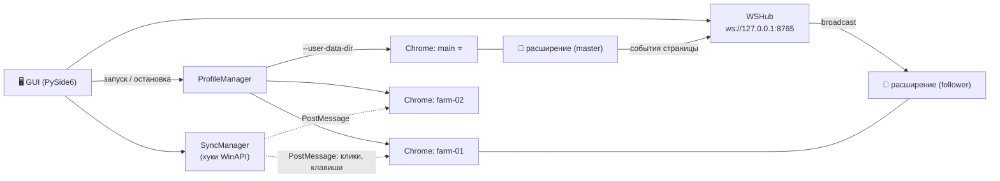

<div align="center">

# 🌐 Chrome Profiles Manager

**Менеджер изолированных Chrome-профилей для Windows с зеркалированием действий:
одно окно — мастер, остальные повторяют клики, клавиатуру и навигацию.**


</div>

---

## 📸 Скриншоты

| Управление профилями | Синхронизация |
|:---:|:---:|
|  |  |

## ✨ Возможности

- 🗂 **Управление профилями** — создание (в том числе массовое: `имя × N`), запуск, остановка и удаление изолированных Chrome-профилей из тёмного GUI. Каждый профиль — отдельная папка в `profiles/` со своими куками и сессиями.
- ⚙️ **Настройки на профиль** — стартовая страница и прокси (`host:port`) хранятся в `profile.json` внутри папки профиля и подставляются при запуске.
- 🖱 **Нативная синхронизация ввода** — глобальные хуки Windows: клики, колесо и клавиатура из мастер-окна повторяются во всех остальных окнах через WinAPI (`PostMessage`).
- 🔄 **Зеркалирование внутри страниц** — MV3-расширение подключается к локальному WebSocket-хабу (`ws://127.0.0.1:8765`) и повторяет ввод текста и навигацию между профилями.
- ⭐ **Гибкий выбор мастера** — мастером можно назначить и профиль (нативный ввод), и WS-клиента (зеркалирование страниц); отдельных клиентов можно временно отключать галочкой.
- 🔗 **Привязка окон** — автоматическое сопоставление PID/HWND запущенных окон Chrome с профилями по `--user-data-dir`.

## 🏗 Как это устроено



Два независимых канала синхронизации:

1. **Нативный (WinAPI)** — глобальные хуки `keyboard`/`mouse` перехватывают ввод в мастер-окне и рассылают его остальным окнам Chrome сообщениями Windows. Работает везде, включая адресную строку и системные диалоги.
2. **Страничный (WebSocket + MV3)** — расширение в каждом профиле ловит ввод текста и навигацию на странице и передаёт через локальный хаб followers-профилям. Точнее для форм и SPA.

## 📦 Установка

Требования: **Windows 10/11**, **Python 3.11+**, **Google Chrome**. Для глобальных хуков нужен запуск от администратора.

```bat
git clone https://github.com/GAVRS1/Chrome-profiles-manager.git
cd Chrome-profiles-manager
install.bat
```

Или вручную:

```bat
python -m venv .venv
.venv\Scripts\pip install -r requirements.txt
```

## ▶️ Запуск

```bat
start.bat
```

`start.bat` сам запросит права администратора, создаст окружение при первом запуске и стартует приложение. Вручную:

```bat
.venv\Scripts\python src\main.py
```

Параметры по умолчанию (пути к Chrome, порт хаба, аргументы запуска) — в [`src/app/config.py`](src/app/config.py).

## 🚀 Быстрый старт

1. На вкладке **Профили** создайте несколько профилей (например `farm × 5`) и запустите их.
2. На вкладке **Синхронизация** включите WS-сервер и нажмите **Назначить Мастером** для нужного профиля.
3. Нажмите **Включить синхронизацию** — клики и клавиатура из мастер-окна пойдут во все остальные.

## 🧩 Расширение для зеркалирования страниц

1. Откройте `chrome://extensions`, включите **Developer mode**.
2. **Load unpacked** → выберите папку `extension/`.
3. В **Extension options** укажите имя профиля (как в GUI) и WS URL: `ws://127.0.0.1:8765`.
4. Повторите для каждого профиля — настройки хранятся внутри профиля.
5. В GUI назначьте мастер-профиль и откройте сайт в каждой вкладке.

Подробнее: [extension/README_extension.md](extension/README_extension.md)

## 🗂 Структура проекта

```
├── src/
│   ├── main.py                   # точка входа
│   └── app/
│       ├── gui.py                # главное окно (PySide6)
│       ├── theme.py              # тёмная тема (QSS)
│       ├── profile_manager.py    # создание / запуск / остановка профилей
│       ├── profile_settings.py   # настройки профиля (profile.json)
│       ├── chrome_window_manager.py  # поиск и привязка окон Chrome
│       ├── sync_manager.py       # хуки ввода и доставка событий в окна
│       ├── ws_hub.py             # WebSocket-хаб для расширения
│       └── config.py             # настройки
├── extension/                    # MV3-расширение для зеркалирования страниц
├── install.bat                   # установка окружения
└── start.bat                     # запуск (с правами администратора)
```

## ⚠️ Замечания

- WebSocket-хаб слушает только `127.0.0.1` — не пробрасывайте его наружу.
- Для глобальных хуков и отправки сообщений в окна нужны права администратора.
- Папка `profiles/` создаётся автоматически и в git не попадает.

---

<div align="center">

Сделано с ❤️ автором **[gavrs](https://github.com/GAVRS1)**

</div>
